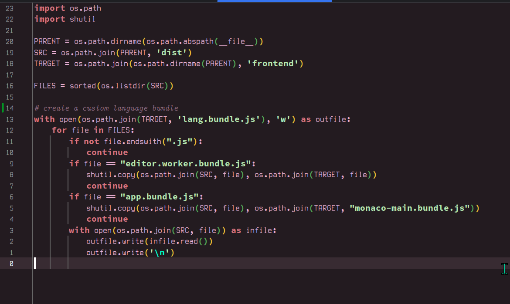
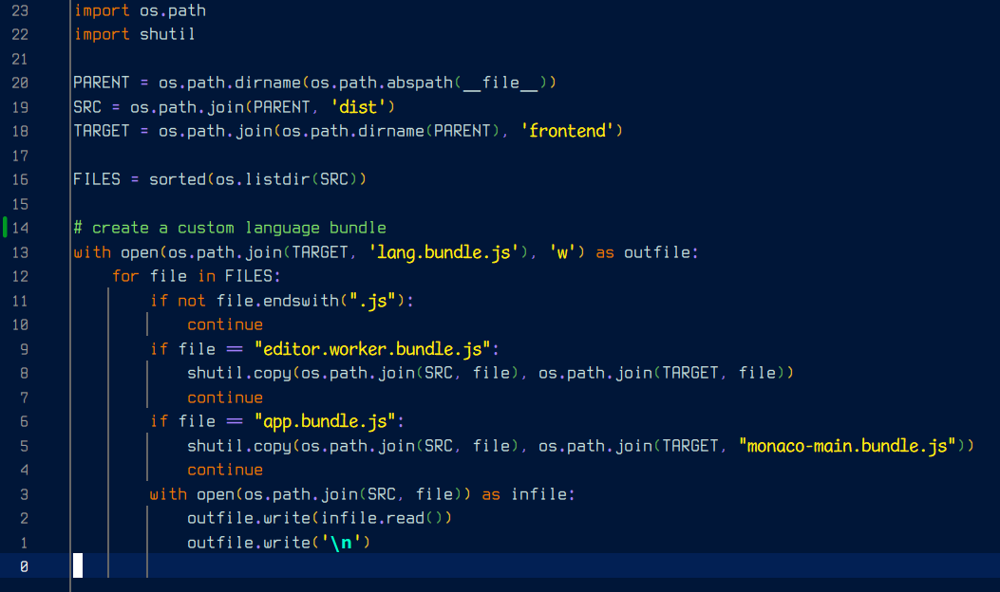
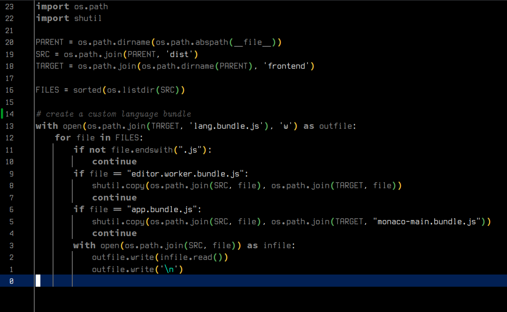
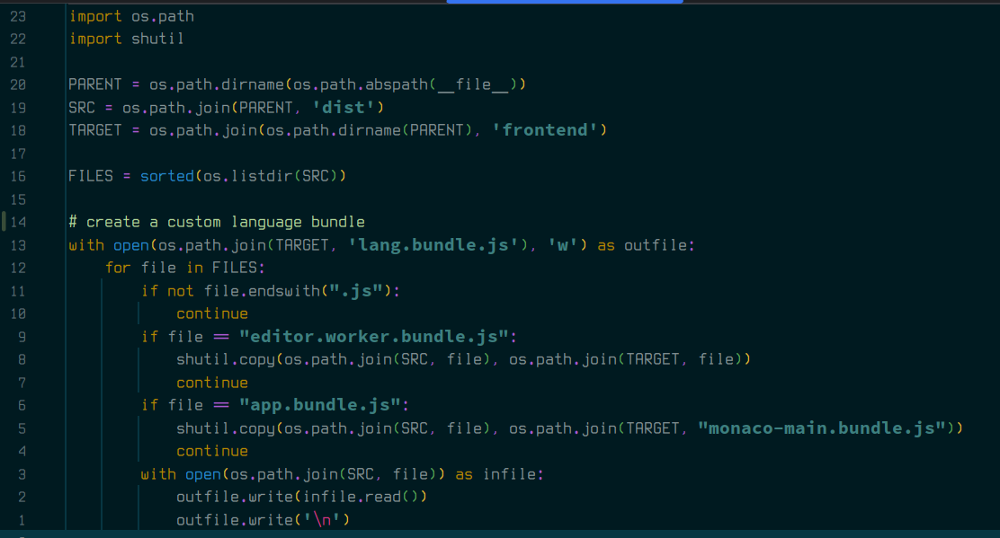

# JaDogg Mono

What is JaDogg Mono? - a custom font for personal use.

Combination of multiple fonts renamed to used in editors like IntelliJ.

**Why?** Procrastination

**Note** even though mono is in name, different fonts are different size 😢

## Screenshots

See below for individual licenses.

### Regular     - Terminus with ligatures from FiraCode

Copyright (C) 2020 Dimitar Toshkov Zhekov; Copyright (C) 2023 Tilman Blumenbach; Licensed under the SIL Open Font License, Version 1.1
Programming ligatures added by Ilya Skriblovsky from FiraCode
FiraCode Copyright (c) 2015 by Nikita Prokopov

### Bold        - Source Code Pro

(c) 2010 - 2012 Adobe Systems Incorporated (http://www.adobe.com/), with Reserved Font Name `Source'.

### Italic      - Latin Modern

Copyright 2003, 2008 B. Jackowski and J. M. Nowacki (on behalf of TeX users groups). This work is released under the GUST Font License --  see http://tug.org/fonts/licenses/GUST-FONT-LICENSE.txt for details.

### Bold Italic - Comic mono

MIT
Original work Copyright (c) 2018 Shannon Miwa
Modified work Copyright (c) 2019 dtinth
